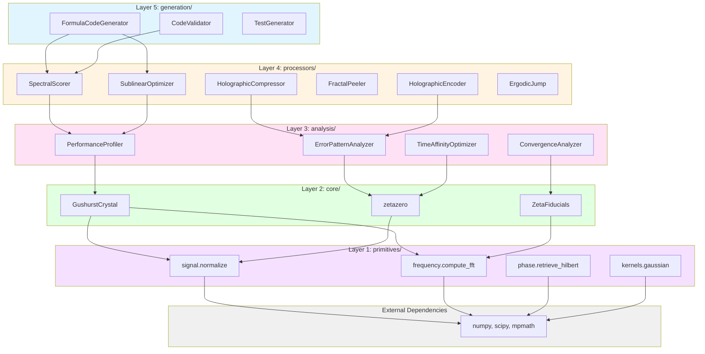

# Quick Start for AI

This guide provides the fastest path for AI agents to understand and use the Holographer's Workbench.

## 🎯 Common Tasks → Exact Imports

| Task | Import | Example |
|------|--------|---------|
| **Score candidates with zeta zeros** | `from workbench import SpectralScorer, ZetaFiducials` | `scorer = SpectralScorer(frequencies=ZetaFiducials.get_standard(20))` |
| **Extract signal envelope** | `from workbench import phase_retrieve_hilbert` | `envelope, pv = phase_retrieve_hilbert(signal)` |
| **Refine noisy signal** | `from workbench import holographic_refinement` | `refined = holographic_refinement(signal, reference)` |
| **Find top-k efficiently** | `from workbench import SublinearOptimizer` | `top_k, stats = optimizer.optimize(candidates, score_fn, top_k=100)` |
| **Compress data losslessly** | `from workbench import FractalPeeler` | `tree = peeler.compress(data)` |
| **Compress images** | `from workbench import HolographicCompressor` | `compressed, stats = compressor.compress(image)` |
| **Compute zeta zeros fast** | `from workbench import zetazero, zetazero_batch` | `z = zetazero(100)  # 26× faster than mpmath` |
| **Predict primes/zeros** | `from workbench import GushurstCrystal` | `gc = GushurstCrystal(n_zeros=500)` |
| **Profile performance** | `from workbench import PerformanceProfiler` | `profiler = PerformanceProfiler()` |
| **Analyze errors** | `from workbench import ErrorPatternAnalyzer` | `analyzer = ErrorPatternAnalyzer(actual, predicted, x)` |
| **Generate code** | `from workbench import FormulaCodeGenerator` | `gen = FormulaCodeGenerator('np.sin(x)', 'my_func')` |
| **Check convergence** | `from workbench import ConvergenceAnalyzer` | `analyzer = ConvergenceAnalyzer(history)` |
| **Discover parameters** | `from workbench import quick_calibrate` | `result = quick_calibrate(algorithm, target_time, bounds)` |
| **Encode neural weights** | `from workbench import HolographicEncoder` | `encoder = HolographicEncoder(gushurst_crystal)` |
| **Test ergodicity** | `from workbench import ErgodicJump` | `jump = ErgodicJump(freq=0.447)` |

## 📁 File Locations (for web scraping)

All source files are in `workbench/`:

### Layer 1: Primitives
- `workbench/primitives/signal.py` ([view source](https://github.com/lostdemeter/holographersworkbench/blob/main/workbench/primitives/signal.py)) - Signal processing utilities
- `workbench/primitives/frequency.py` ([view source](https://github.com/lostdemeter/holographersworkbench/blob/main/workbench/primitives/frequency.py)) - FFT operations
- `workbench/primitives/phase.py` ([view source](https://github.com/lostdemeter/holographersworkbench/blob/main/workbench/primitives/phase.py)) - Phase retrieval
- `workbench/primitives/kernels.py` ([view source](https://github.com/lostdemeter/holographersworkbench/blob/main/workbench/primitives/kernels.py)) - Kernel functions

### Layer 2: Core
- `workbench/core/zeta.py` ([view source](https://github.com/lostdemeter/holographersworkbench/blob/main/workbench/core/zeta.py)) - Fast zeta zero computation
- `workbench/core/gushurst_crystal.py` ([view source](https://github.com/lostdemeter/holographersworkbench/blob/main/workbench/core/gushurst_crystal.py)) - Unified number-theoretic framework

### Layer 3: Analysis
- `workbench/analysis/performance.py` ([view source](https://github.com/lostdemeter/holographersworkbench/blob/main/workbench/analysis/performance.py)) - Performance profiling
- `workbench/analysis/errors.py` ([view source](https://github.com/lostdemeter/holographersworkbench/blob/main/workbench/analysis/errors.py)) - Error pattern detection
- `workbench/analysis/convergence.py` ([view source](https://github.com/lostdemeter/holographersworkbench/blob/main/workbench/analysis/convergence.py)) - Convergence analysis
- `workbench/analysis/affinity.py` ([view source](https://github.com/lostdemeter/holographersworkbench/blob/main/workbench/analysis/affinity.py)) - Time affinity optimization

### Layer 4: Processors
- `workbench/processors/spectral.py` ([view source](https://github.com/lostdemeter/holographersworkbench/blob/main/workbench/processors/spectral.py)) - Spectral scoring
- `workbench/processors/holographic.py` ([view source](https://github.com/lostdemeter/holographersworkbench/blob/main/workbench/processors/holographic.py)) - Phase retrieval & refinement
- `workbench/processors/optimization.py` ([view source](https://github.com/lostdemeter/holographersworkbench/blob/main/workbench/processors/optimization.py)) - Sublinear optimization
- `workbench/processors/compression.py` ([view source](https://github.com/lostdemeter/holographersworkbench/blob/main/workbench/processors/compression.py)) - Fractal peeling & holographic compression
- `workbench/processors/encoding.py` ([view source](https://github.com/lostdemeter/holographersworkbench/blob/main/workbench/processors/encoding.py)) - Holographic encoding
- `workbench/processors/ergodic.py` ([view source](https://github.com/lostdemeter/holographersworkbench/blob/main/workbench/processors/ergodic.py)) - Ergodic jump diagnostics

### Layer 5: Generation
- `workbench/generation/code.py` ([view source](https://github.com/lostdemeter/holographersworkbench/blob/main/workbench/generation/code.py)) - Formula code generation

## 🔄 Dependency Flow



**Rule**: Higher layers can import from lower layers, never the reverse.

**Key Relationships**:
- `FormulaCodeGenerator` uses `SpectralScorer` and `SublinearOptimizer`
- `SpectralScorer` uses `PerformanceProfiler` for optimization
- `ErrorPatternAnalyzer` uses `zetazero` for spectral analysis
- `GushurstCrystal` uses `signal.normalize` and `frequency.compute_fft`
- All primitives depend on numpy/scipy/mpmath

## 🚀 5-Minute Quickstart

### 1. Spectral Scoring (Most Common)
```python
from workbench import SpectralScorer, ZetaFiducials

# Get zeta zeros as frequencies
zeros = ZetaFiducials.get_standard(20)

# Score candidates
scorer = SpectralScorer(frequencies=zeros, damping=0.05)
scores = scorer.compute_scores(candidates, shift=0.05)

# Find top candidates
top_idx = scores.argsort()[-10:][::-1]
```

### 2. Complete Optimization Pipeline
```python
from workbench import (
    SpectralScorer, 
    holographic_refinement,
    SublinearOptimizer,
    ZetaFiducials
)

# Step 1: Spectral scoring
zeros = ZetaFiducials.get_standard(20)
scorer = SpectralScorer(frequencies=zeros)
scores = scorer.compute_scores(candidates)

# Step 2: Holographic refinement
reference = 1.0 / (np.log(candidates + 2) + 1e-12)
refined = holographic_refinement(scores, reference)

# Step 3: Sublinear optimization
optimizer = SublinearOptimizer()
top_k, stats = optimizer.optimize(candidates, lambda c: refined[c], top_k=100)
```

### 3. Full Optimization Toolkit (4 Steps)
```python
from workbench import (
    PerformanceProfiler,
    ErrorPatternAnalyzer,
    FormulaCodeGenerator,
    ConvergenceAnalyzer
)

# Step 1: Profile
profiler = PerformanceProfiler()
result, profile = profiler.profile_function(my_func, args)

# Step 2: Analyze errors
analyzer = ErrorPatternAnalyzer(actual, predicted, x)
report = analyzer.analyze_all()

# Step 3: Generate code
generator = FormulaCodeGenerator('base_formula', 'improved_func')
for suggestion in report.suggestions:
    generator.add_correction(suggestion.code_snippet)
code = generator.generate_function()

# Step 4: Monitor convergence
conv_analyzer = ConvergenceAnalyzer(rmse_history)
conv_report = conv_analyzer.analyze()
if conv_report.stopping_recommendation.should_stop:
    print("Optimization complete!")
```

## 💡 Key Patterns

### Pattern 1: All imports work from `workbench`
```python
# Simple (recommended for users)
from workbench import SpectralScorer

# Explicit (recommended for library developers)
from workbench.processors.spectral import SpectralScorer

# Both work identically!
```

### Pattern 2: Zeta zeros are everywhere
```python
# Fast computation (26× faster than mpmath)
from workbench import zetazero, zetazero_batch

z = zetazero(100)  # Single zero: ~2.5ms
zeros = zetazero_batch(1, 1000)  # Batch: ~1.68ms/zero

# Standard sets (cached)
from workbench import ZetaFiducials
zeros = ZetaFiducials.get_standard(20)  # Most common
```

### Pattern 3: Unified framework
```python
# Gushurst Crystal: Primes + Zeta Zeros + Fractal Analysis
from workbench import GushurstCrystal

gc = GushurstCrystal(n_zeros=500, max_prime=10000)
structure = gc.analyze_crystal_structure()
primes = gc.predict_primes(n_primes=10)
zeros = gc.predict_zeta_zeros(n_zeros=5)
```

### Pattern 4: Pipelines compose naturally
```python
# Each module returns data that the next module expects
scores = scorer.compute_scores(candidates)          # → np.array
refined = holographic_refinement(scores, ref)       # → np.array  
top_k, stats = optimizer.optimize(candidates, ...)  # → (np.array, stats)
```

## 📚 Documentation Hierarchy

1. **QUICK_START_AI.md** ([this file](QUICK_START_AI.md) | [view on GitHub](https://github.com/lostdemeter/holographersworkbench/blob/main/QUICK_START_AI.md)) - Start here for imports
2. **README.md** ([local](README.md) | [view on GitHub](https://github.com/lostdemeter/holographersworkbench/blob/main/README.md)) - Full module documentation with examples
3. **AI_README.md** ([local](AI_README.md) | [view on GitHub](https://github.com/lostdemeter/holographersworkbench/blob/main/AI_README.md)) - Concise API tables and math formulas
4. **ARCHITECTURE.md** ([local](ARCHITECTURE.md) | [view on GitHub](https://github.com/lostdemeter/holographersworkbench/blob/main/ARCHITECTURE.md)) - Layer structure and design patterns
5. **Source files** - Docstrings with inline examples (see file locations above)

## 🎓 Learning Path for AI

1. **Read this file** (5 min) - Get import patterns
2. **Try one example** (5 min) - Run spectral scoring
3. **Read README.md** (15 min) - Understand all modules
4. **Check ARCHITECTURE.md** (10 min) - Understand layer rules
5. **Browse source** (as needed) - Deep dive into implementations

## 🔍 Finding Functionality

**By task**: Use the table at the top of this file
**By module**: Check [README.md](https://github.com/lostdemeter/holographersworkbench/blob/main/README.md) section headers
**By layer**: See [ARCHITECTURE.md](https://github.com/lostdemeter/holographersworkbench/blob/main/ARCHITECTURE.md)
**By API**: Check [AI_README.md](https://github.com/lostdemeter/holographersworkbench/blob/main/AI_README.md) tables
**By example**: See `examples/` ([view on GitHub](https://github.com/lostdemeter/holographersworkbench/tree/main/examples))

## ⚡ Performance Tips

- Use `zetazero_batch()` for multiple zeros (parallel)
- Use `ZetaFiducials.get_standard()` for cached zeros
- Use `SublinearOptimizer` for O(√n) complexity
- Use `quick_calibrate()` for parameter discovery
- Use `PerformanceProfiler` to find bottlenecks

## 🐛 Common Mistakes

1. ❌ `from workbench.spectral import SpectralScorer`
   - ✅ `from workbench.processors.spectral import SpectralScorer`
   - ✅ `from workbench import SpectralScorer` (simpler!)

2. ❌ Using `mpmath.zetazero()` directly
   - ✅ Use `workbench.zetazero()` (26× faster)

3. ❌ Importing from higher layers in lower layers
   - ✅ Follow dependency flow: 1→2→3→4→5

4. ❌ Not using `ZetaFiducials` for repeated zeros
   - ✅ Use `ZetaFiducials.get_standard()` (cached)

## 📞 Need Help?

- **Examples**: See `examples/` directory ([view on GitHub](https://github.com/lostdemeter/holographersworkbench/tree/main/examples)) - 6 Python scripts, 5 notebooks
- **Tests**: See `tests/test_workbench.py` ([view source](https://github.com/lostdemeter/holographersworkbench/blob/main/tests/test_workbench.py)) - 16 unit tests
- **Notebooks**: See `examples/notebooks/` ([view on GitHub](https://github.com/lostdemeter/holographersworkbench/tree/main/examples/notebooks)) - 5 Jupyter notebooks
- **Issues**: [GitHub Issues](https://github.com/lostdemeter/holographersworkbench/issues) for bugs/questions

---

**TL;DR**: Import everything from `workbench`, follow the task table, compose pipelines naturally. 🚀
