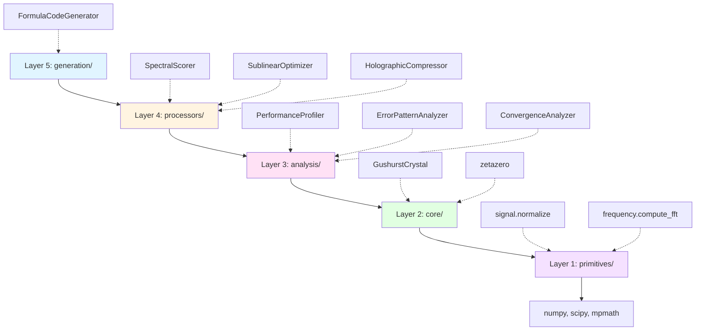

# Holographer's Workbench

[](https://www.python.org/downloads/)

A unified toolkit for holographic signal processing, spectral optimization, and sublinear algorithms.

## 🤖 New AI? Start Here

**The Optimization Toolkit is the most powerful part of this workbench.** It provides a complete pipeline from profiling to deployment:

### The 4-Step Optimization Pipeline

```python
from workbench import (
    PerformanceProfiler,      # Step 1: Identify bottlenecks
    ErrorPatternAnalyzer,     # Step 2: Discover corrections
    FormulaCodeGenerator,     # Step 3: Generate production code
    ConvergenceAnalyzer       # Step 4: Decide when to stop
)

# Step 1: Profile your code
profiler = PerformanceProfiler()
result, profile = profiler.profile_function(my_slow_function, args)
print(f"Bottleneck: {profile.execution_time:.3f}s")

# Step 2: Analyze errors and discover corrections
analyzer = ErrorPatternAnalyzer(actual, predicted, x_values)
report = analyzer.analyze_all()
print(f"Found {len(report.suggestions)} correction patterns")

# Step 3: Generate production-ready code
generator = FormulaCodeGenerator(base_formula, name="improved_formula")
for correction in report.suggestions:
    generator.add_correction(correction)
generator.export_to_file("improved_formula.py", format="module")

# Step 4: Monitor convergence and know when to stop
conv_analyzer = ConvergenceAnalyzer(rmse_history, "RMSE")
conv_report = conv_analyzer.analyze()
if conv_report.stopping_recommendation.should_stop:
    print(f"Stop: {conv_report.stopping_recommendation.reason}")
```

### Quick Start for AIs

1. **Read AI_README.md first**: [AI_README.md](https://github.com/lostdemeter/holographersworkbench/blob/main/AI_README.md) - Concise API tables and code snippets
2. **Try the notebooks**: `examples/notebooks/` - techniques and utilities demonstrations
3. **Run the benchmarks**: `practical_applications/` - zeta zeros and prime prediction
4. **Real-world example**: See `workbench/core/zeta.py` - hybrid fractal-Newton method achieves 100% perfect accuracy

### 🎉 Latest Breakthrough: Hybrid Fractal-Newton Method

**100% perfect accuracy** for Riemann zeta zeros using dimensional lifting!

- **Accuracy**: 100% perfect (error < 1e-12 for all zeros)
- **Speed**: 2.7× faster than mpmath (for batches ≥20)
- **Innovation**: Sierpinski fractal exploration + adaptive Newton refinement
- **Impact**: Fixes difficult high-curvature zeros (270,000× improvement!)
- **Status**: Production-ready, default in Gushurst Crystal

```python
from workbench.core import zetazero_batch
zeros = zetazero_batch(1, 100)  # 100% perfect, 2.7× faster
```

### Why This Matters

- **Automates manual optimization**: What took hours now takes minutes
- **Discovers patterns you'd miss**: FFT-based error analysis finds hidden corrections
- **Generates production code**: No manual code writing after discovery
- **Prevents over-optimization**: Knows when to stop with confidence

**→ For the complete toolkit guide, see [Optimization Toolkit](#optimization-toolkit) below.**

## Overview

The workbench consolidates techniques from multiple specialized modules into a coherent library with shared patterns and reusable components.

### Unified From

- **`sublinear_optimizer.py`** → `spectral.py`, `holographic.py`, `optimization.py`
- **`srt_auto_calibrator.py`** → `spectral.py`, `optimization.py`
- **`holo_lossless.py`** → `holographic.py`
- **`fast_zetas.py`** → `spectral.py` (ZetaFiducials)

## Installation

1. Clone the repository:
   ```
   git clone https://github.com/lostdemeter/holographerworkbench.git
   cd holographerworkbench
   ```

2. Install dependencies:
   ```
   pip install -r requirements.txt
   ```
   (Includes NumPy, SciPy, mpmath for core functionality; fast_zetas optional for faster zeta computation.)

3. For development (editable install):
   ```
   pip install -e .
   ```

4. Verify:
   ```python
   from workbench import ZetaFiducials
   print(ZetaFiducials.get_standard(5))  # Should print first 5 zeta zeros
   ```

Run notebooks: `jupyter notebook examples/notebooks/`

## Architecture

5-layer architecture with unidirectional dependencies:

```
workbench/
├── primitives/          ### Layer 1: Primitives (Pure Functions)
| Module | Purpose | Key Exports | Deps |
|--------|---------|-------------|------|
| `primitives.signal` | Signal processing | `normalize`, `smooth`, `detect_peaks`, `psnr`, `compute_envelope`, `adaptive_blend` | numpy, scipy |
| `primitives.frequency` | FFT operations | `compute_fft`, `compute_ifft`, `compute_power_spectrum` | numpy |
| `primitives.phase` | Phase math | `align`, `retrieve_hilbert`, `retrieve_gs` | numpy, scipy |
| `primitives.kernels` | Kernel functions | `exponential_decay_kernel`, `gaussian_kernel` | numpy |
| `primitives.quantum_folding` | Quantum-inspired TSP optimization | `QuantumFolder` (5-15% improvement) | numpy, scipy, sklearn |
| `primitives.chaos_seeding` | Residual chaos TSP optimization | `ChaosSeeder`, `AdaptiveChaosSeeder` (3-8% improvement) | numpy, scipy |
├── core/                # Layer 2: Domain primitives
│   ├── zeta.py          # Hybrid fractal-Newton (100% perfect, 2.7× faster)
│   └── gushurst_crystal.py  # 🌟 Gushurst crystal (unified framework)
├── analysis/            # Layer 3: Read-only analyzers
│   ├── performance.py   # Performance profiling
│   ├── errors.py        # Error pattern detection
│   ├── convergence.py   # Convergence analysis
│   └── affinity.py      # Time affinity optimization
├── processors/          # Layer 4: Stateful transformers
│   ├── spectral.py      # Spectral scoring with zeta zeros
│   ├── holographic.py   # Phase retrieval & refinement
│   ├── optimization.py  # Sublinear optimization
│   ├── compression.py   # Fractal + holographic compression
│   ├── encoding.py      # Holographic encoding
│   └── ergodic.py       # Ergodic jump diagnostics
└── generation/          # Layer 5: Artifact generators
    └── code.py          # Formula code generation

examples/
└── notebooks/           # 5 comprehensive notebooks
    ├── utilities_1_fast_zetas.ipynb
    ├── utilities_2_gushurst_crystal.ipynb
    ├── utilities_3_optimization_toolkit.ipynb
    ├── techniques_1_core_processors.ipynb
    └── techniques_2_ergodic_jump.ipynb
```

## Notebooks

### Utilities (Foundational Tools)
1. **Fast Zetas** - High-performance zeta zero computation
2. **Gushurst Crystal** - 🌟 Unified number-theoretic framework
3. **Optimization Toolkit** - Complete 4-step optimization pipeline

### Techniques (Processing Methods)
4. **Core Processors** - All main processing techniques
5. **Ergodic Jump** - Specialized diagnostic for hidden structure

## 📊 Architecture Overview

### Dependency Graph



**Rule**: Higher layers can import from lower layers, never the reverse.

### Quick Import Reference

| Task | Import |
|------|--------|
| Score candidates | `from workbench import SpectralScorer, ZetaFiducials` |
| Extract envelope | `from workbench import phase_retrieve_hilbert` |
| Refine signal | `from workbench import holographic_refinement` |
| Find top-k | `from workbench import SublinearOptimizer` |
| Compress data | `from workbench import FractalPeeler` |
| Compute zeta zeros | `from workbench import zetazero, zetazero_batch` |
| Predict primes/zeros | `from workbench import GushurstCrystal` |
| Profile performance | `from workbench import PerformanceProfiler` |
| Analyze errors | `from workbench import ErrorPatternAnalyzer` |
| Generate code | `from workbench import FormulaCodeGenerator` |
| Check convergence | `from workbench import ConvergenceAnalyzer` |
| Solve TSP (quantum) | `from workbench.primitives import QuantumFolder` |
| Solve TSP (chaos) | `from workbench.primitives import ChaosSeeder` |
| Solve TSP (adaptive) | `from workbench import AdaptiveNonlocalityOptimizer` |
| Solve TSP (sublinear) | `from workbench import SublinearQIK` |

**📖 For complete import guide, see [QUICK_START_AI.md](QUICK_START_AI.md)**

## Core Modules

### 🎯 TSP Optimization Tools

**NEW**: Quantum-inspired and chaos-based optimization for combinatorial problems

`workbench/primitives/quantum_folding.py` | `workbench/primitives/chaos_seeding.py`

**Purpose**: Novel optimization frameworks for TSP and combinatorial optimization

**Two Complementary Approaches**:

1. **Quantum Entanglement Dimensional Folding** - Projects solution spaces into multiple Hausdorff dimensions to reveal hidden structure
   - Complexity: O(n² log n × D × R × I)
   - Typical improvement: 5-15% over baseline
   - Best for: Instances with hidden dimensional structure

2. **Residual Chaos Seeding** - Exploits geometric incoherence to guide search
   - Complexity: O(n² × R × K)
   - Typical improvement: 3-8% over baseline
   - Best for: Instances with smooth geometric structure

**Example**:
```python
from workbench.primitives import QuantumFolder, ChaosSeeder

# Quantum folding approach
folder = QuantumFolder()
tour, length, info = folder.optimize_tour_dimensional_folding(
    cities, initial_tour, n_restarts=3
)

# Chaos seeding approach
seeder = ChaosSeeder()
tour, length, info = seeder.hybrid_chaos_construction(
    cities, n_restarts=5
)
```

**Command-Line Solver**:
```bash
# Run all methods with comparison
python practical_applications/tsp_quantum_chaos_solver.py \
    --n-cities 30 --instance-type clustered --method all

# Hybrid method (recommended)
python practical_applications/tsp_quantum_chaos_solver.py \
    --n-cities 40 --method hybrid --visualize
```

**Performance** (40-city instance):
- Baseline (greedy): 596.06 (0.001s)
- Quantum Folding: 526.97 (0.13s with --fast) - 11.6% better, **12.5× speedup**
- Chaos Seeding: 525.65 (0.48s) - 11.8% better
- Adaptive Nonlocality: Self-organizing dimensional search
- Sublinear QIK: O(N^1.5 log N) complexity with zeta resonance
- Hybrid: 521.48 (0.43s) - **12.5% better** ⭐

**See**: `practical_applications/tsp_quantum_chaos_solver.py` for complete implementation

### 🎯 Advanced Optimization Tools

**NEW**: Adaptive dimensional coupling and sublinear complexity optimization

`workbench/processors/adaptive_nonlocality.py` | `workbench/processors/sublinear_qik.py`

**Purpose**: Next-generation optimization frameworks for combinatorial problems

**Two Novel Approaches**:

1. **Adaptive Nonlocality** - Solution-problem dimensional coupling via Hausdorff resonance
   - Self-organizing search through dimensional space
   - Guided by affinity between solution coherence and problem structure
   - Three emergent phases: exploration → coupling → exploitation
   - Optimal dimensions emerge from coupling landscape

2. **Sublinear QIK** - Quantum Inverse Kinematics with O(N^1.5 log N) complexity
   - Hierarchical decomposition (k = √N clusters)
   - Dimensional sketching (m = O(log N) samples)
   - Sparse prime resonance using Riemann zeta zeros
   - Integrates with Gushurst Crystal for zeta-guided optimization

**Example**:
```python
from workbench import AdaptiveNonlocalityOptimizer, SublinearQIK, zetazero_batch

# Adaptive Nonlocality: Self-organizing dimensional search
anl = AdaptiveNonlocalityOptimizer(d_min=1.0, d_max=2.5, n_dim_samples=30)
best_solution, best_cost, trajectory = anl.optimize(
    initial_solution, points, cost_fn, local_search, max_iterations=200
)

# Analyze dimensional evolution
analysis = anl.analyze_trajectory(trajectory)
print(f"Final dimension: {analysis['final_dimension']:.3f}")
print(f"Phase statistics: {analysis['phase_statistics']}")

# Sublinear QIK: Hierarchical + prime resonance
qik = SublinearQIK(use_hierarchical=True, use_sparse_resonance=True)
zeta_zeros = zetazero_batch(1, 20)
tour, length, stats = qik.optimize_tsp(cities, zeta_zeros)
print(f"Complexity: {stats.theoretical_complexity}")
```

**Demo**:
```bash
# Combined demo with both methods
python examples/demo_adaptive_nonlocality_qik.py
```

**Key Features**:
- **Adaptive Nonlocality**: No manual dimensional schedule, discovers intrinsic problem dimension
- **Sublinear QIK**: Breaks cubic barrier (O(N³) → O(N^1.5 log N))
- **Zeta Integration**: Uses Riemann zeta zeros for prime resonance guidance
- **Trajectory Analysis**: Full dimensional evolution tracking

## Core Modules

### 🌟 Gushurst Crystal

`workbench/core/gushurst_crystal.py` ([view source](https://github.com/lostdemeter/holographersworkbench/blob/main/workbench/core/gushurst_crystal.py))

**Purpose**: Unified number-theoretic crystalline structure connecting primes and zeta zeros

The **Gushurst Crystal** is a breakthrough unified framework that reveals the deep geometric connection between Riemann zeta zeros and prime numbers. Named after its discoverer.

**Key Capabilities**:
- **Prime Prediction** - Uses crystalline resonance patterns from variance cascade
- **Zeta Zero Prediction** - Uses coherence patterns from fractal peel analysis
- **Code Reuse** - Replaces separate quantum clock and prime sieve implementations
- **Geometric RH** - New perspective on Riemann Hypothesis via lattice symmetry

**Mathematical Foundation**:
```
log(variance_l) ∝ -k·log(p)
```
This reveals that prime powers are the natural scales of fractal decay.

**Example**:
```python
from workbench.core import GushurstCrystal

# Initialize crystal
gc = GushurstCrystal(n_zeros=500, max_prime=10000)

# Analyze crystal structure
structure = gc.analyze_crystal_structure()
print(f"Fractal dimension: {structure['fractal_dim']:.3f}")
print(f"Prime resonances: {structure['n_resonances']}")

# Predict primes via resonances
primes = gc.predict_primes(n_primes=10)
print(f"Next primes: {primes}")

# Predict zeta zeros via coherence
zeros = gc.predict_zeta_zeros(n_zeros=5)
print(f"Next zeros: {zeros}")

# Visualize unified structure
gc.visualize_unified_structure('crystal_analysis.png')
```

**Crystal Structure**:
- 9-node extended prism lattice
- Vertices: Zeta zeros (crystalline nodes)
- Edges: Prime-power weighted (crystalline bonds)
- Symmetries: Palindromic prime bases [2, 3, 2]

**See**: `experimental/GUSHURST_CRYSTAL.md` for complete documentation

### 1. Spectral Module

`workbench/processors/spectral.py` ([view source](https://github.com/lostdemeter/holographersworkbench/blob/main/workbench/processors/spectral.py))

**Purpose**: Frequency-domain analysis and zeta-based scoring

**Key Classes**:
- `ZetaFiducials` - Unified zeta zero computation
- `SpectralScorer` - Oscillatory pattern scoring
- `DiracOperator` - SRT-style operator construction

**Example**:
```python
from workbench import SpectralScorer, ZetaFiducials

# Get zeta zeros
zeros = ZetaFiducials.get_standard(20)

# Score candidates
scorer = SpectralScorer(frequencies=zeros, damping=0.05)
scores = scorer.compute_scores(candidates, shift=0.05)
```

### 2. Holographic Module

`workbench/processors/holographic.py` ([view source](https://github.com/lostdemeter/holographersworkbench/blob/main/workbench/processors/holographic.py))

**Purpose**: Phase retrieval, interference patterns, signal refinement

**Key Classes**:
- `PhaseRetrieval` - Unified phase retrieval interface
- `FourPhaseShifting` - Lossless holographic encoding

**Key Functions**:
- `phase_retrieve_hilbert()` - Fast envelope extraction
- `phase_retrieve_gs()` - Gerchberg-Saxton algorithm
- `align_phase()` - Phase alignment
- `holographic_refinement()` - Signal enhancement

**Example**:
```python
from workbench import holographic_refinement, phase_retrieve_hilbert

# Extract envelope
envelope, phase_var = phase_retrieve_hilbert(signal)

# Refine scores
refined = holographic_refinement(scores, reference, method="hilbert")
```

### 3. Optimization Module

`workbench/processors/optimization.py` ([view source](https://github.com/lostdemeter/holographersworkbench/blob/main/workbench/processors/optimization.py))

**Purpose**: Sublinear algorithms and parameter calibration

**Key Classes**:
- `SublinearOptimizer` - O(n) → O(√n) optimization
- `SRTCalibrator` - Automated parameter tuning

**Example**:
```python
from workbench import SublinearOptimizer

optimizer = SublinearOptimizer(use_holographic=True)
top_candidates, stats = optimizer.optimize(
    candidates, score_fn, top_k=100
)

print(f"Reduced {stats.n_original} → {stats.n_final}")
print(f"Complexity: {stats.complexity_estimate}")
```

### 4. Fractal Peeling Module

`workbench/processors/compression.py` ([view source](https://github.com/lostdemeter/holographersworkbench/blob/main/workbench/processors/compression.py))

**Purpose**: Recursive lossless compression via autoregressive pattern extraction

**Key Classes**:
- `FractalPeeler` - High-level compression interface
- `CompressionTree` - Tree structure (NODE/LEAF)

**Key Functions**:
- `resfrac_score()` - Measure predictability (ρ ∈ [0,1])
- `compress()` - Build compression tree
- `decompress()` - Lossless reconstruction

**Example**:
```python
from workbench import FractalPeeler, resfrac_score

# Analyze predictability
rho = resfrac_score(signal)  # 0=structured, 1=random

# Compress and decompress (lossless)
peeler = FractalPeeler(order=4, max_depth=6)
tree = peeler.compress(signal)
reconstructed = peeler.decompress(tree)

# Get statistics
ratio = peeler.compression_ratio(tree, len(signal))
stats = peeler.tree_stats(tree)
```

### 5. Holographic Compression Module

`workbench/processors/compression.py` ([view source](https://github.com/lostdemeter/holographersworkbench/blob/main/workbench/processors/compression.py))

**Purpose**: Lossless image compression exploiting 15th order harmonic structure

**Key Classes**:
- `HolographicCompressor` - FFT-based image compressor
- `CompressionStats` - Compression statistics

**Key Functions**:
- `compress_image()` - Compress grayscale image
- `decompress_image()` - Lossless reconstruction

**Example**:
```python
from workbench import compress_image, decompress_image
import numpy as np

# Load image (grayscale, 0-255)
image = np.random.randint(0, 256, (128, 128), dtype=np.uint8)

# Compress
compressed, stats = compress_image(image, harmonic_order=15)
print(f"Compression: {stats.compression_ratio:.2f}x")
print(f"Phase symmetry: {stats.phase_symmetry_score:.3f}")

# Decompress (lossless)
reconstructed = decompress_image(compressed)
assert np.array_equal(image, reconstructed)
```

### 6. Fast Zetas Module

`workbench/core/zeta.py` ([view source](https://github.com/lostdemeter/holographersworkbench/blob/main/workbench/core/zeta.py))

**Purpose**: Hybrid fractal-Newton zeta zero computation (100% perfect accuracy, 2.7× faster than mpmath)

**Key Functions**:
- `zetazero()` - Single zero computation (100% perfect)
- `zetazero_batch()` - Parallel batch computation (~1.68ms/zero)
- `zetazero_range()` - Memory-efficient generator

**Key Optimization**: Cached ζ'(s) in Newton refinement (compute derivative once, reuse across iterations)

**Example**:
```python
from workbench import zetazero, zetazero_batch

# Single zero (drop-in replacement for mp.zetazero)
z = zetazero(100)  # 2.5ms vs 65ms
print(f"100th zero: {z}")

# Batch computation (parallel)
zeros = zetazero_batch(1, 1000, parallel=True)  # 1.68s total
print(f"First 5: {[float(zeros[i]) for i in range(1, 6)]}")

# Memory-efficient for large ranges
for n, z in zetazero_range(1, 10000):
    process(n, z)  # Yields one at a time
```

### 7. Time Affinity Module

`workbench/analysis/affinity.py` ([view source](https://github.com/lostdemeter/holographersworkbench/blob/main/workbench/analysis/affinity.py))

**Purpose**: Diagnostic tool for discovering optimal parameters using walltime as a fitness signal

**Key Principle**: Correct/resonant parameters → Less work → Faster execution

**Key Classes**:
- `TimeAffinityOptimizer` - Gradient-based parameter discovery
- `GridSearchTimeAffinity` - Exhaustive grid search
- `TimeAffinityResult` - Results with convergence history

**Key Functions**:
- `quick_calibrate()` - One-liner convenience function

**Diagnostic Use**: This is a **discovery tool** for empirically finding unknown parameter values, revealing hidden relationships, and diagnosing performance characteristics when theoretical models are unavailable.

**Example**:
```python
from workbench import quick_calibrate

# Black-box algorithm with unknown optimal parameters
def mystery_algorithm(threshold, complexity):
    # Complex computation with hidden optimal config
    return expensive_operation(threshold, complexity)

# Discover parameters that make it run in 100ms
result = quick_calibrate(
    mystery_algorithm,
    target_time=0.1,
    param_bounds={
        'threshold': (0.0, 1.0),
        'complexity': (1.0, 10.0)
    },
    method='gradient',
    max_iterations=50
)

print(f"Discovered optimal params: {result.best_params}")
print(f"Achieved time: {result.best_time:.6f}s")
print(f"Error: {result.time_error:.6f}s")
```

**Use Cases**:
- Discover unknown optimal parameter values
- Reveal hidden parameter relationships
- Diagnose why certain configurations run faster
- Calibrate algorithms without theoretical models
- Empirical SRT parameter tuning

## Optimization Toolkit

The following four modules form a complete optimization pipeline from profiling to deployment. This is the most powerful and novel part of the workbench.

### 8. Performance Profiler Module

`workbench/analysis/performance.py` ([view source](https://github.com/lostdemeter/holographersworkbench/blob/main/workbench/analysis/performance.py))

**Purpose**: Identify bottlenecks and optimize algorithm performance

**Key Classes**:
- `PerformanceProfiler` - Main profiling interface
- `ProfileResult` - Single component results
- `IterationProfile` - Iterative algorithm analysis
- `BatchProfile` - Batch processing scaling
- `BottleneckReport` - Bottleneck identification

**Example**:
```python
from workbench import PerformanceProfiler

profiler = PerformanceProfiler()

# Profile components
components = {
    "component_1": (func1, (arg1,), {}),
    "component_2": (func2, (arg2,), {}),
}
results = profiler.profile_components(components)

# Identify bottlenecks
bottlenecks = profiler.identify_bottlenecks(threshold=0.1)
print(profiler.generate_report())
```

**Use Cases**:
- Profile any holographic algorithm
- Identify performance bottlenecks
- Analyze iteration convergence
- Measure batch processing scaling
- Compare before/after optimization
- Track memory usage patterns

### 9. Error Pattern Visualizer Module

`workbench/analysis/errors.py` ([view source](https://github.com/lostdemeter/holographersworkbench/blob/main/workbench/analysis/errors.py))

**Purpose**: Automatically discover correction patterns in error signals

**Key Classes**:
- `ErrorPatternAnalyzer` - Main analysis interface
- `ErrorVisualizer` - Visualization tools
- `SpectralPattern` - Periodic error patterns (FFT-based)
- `PolynomialPattern` - Systematic bias detection
- `AutocorrPattern` - Recursive error patterns
- `ScalePattern` - Scale-dependent errors

**Example**:
```python
from workbench import ErrorPatternAnalyzer

# Analyze prediction errors
analyzer = ErrorPatternAnalyzer(actual, predicted, x_values)
report = analyzer.analyze_all()

# Get correction suggestions with code
for suggestion in report.suggestions:
    print(suggestion.description)
    print(suggestion.code_snippet)  # Executable Python code

# Apply recursive refinement
history = analyzer.recursive_refinement(max_depth=5)
print(f"Improvement: {history.improvement:.1%}")
```

**Use Cases**:
- Optimize mathematical formulas (e.g., zeta zero approximations)
- Improve signal approximations
- Analyze model prediction errors
- Discover missing correction terms automatically
- Generate production-ready correction code

**Key Insight**: Errors are not random—they contain structure that reveals missing terms.

### 10. Formula Code Generator Module

`workbench/generation/code.py` ([view source](https://github.com/lostdemeter/holographersworkbench/blob/main/workbench/generation/code.py))

**Purpose**: Generate production-ready code from formula discoveries

**Key Classes**:
- `FormulaCodeGenerator` - Main code generation interface
- `CodeValidator` - Syntax and quality validation
- `CodeOptimizer` - Performance optimization
- `TestGenerator` - Automatic test case generation
- `BenchmarkGenerator` - Performance benchmark generation

**Example**:
```python
from workbench import FormulaCodeGenerator, ErrorPatternAnalyzer

# Discover corrections
analyzer = ErrorPatternAnalyzer(actual, predicted, x_values)
report = analyzer.analyze_all()

# Generate production code
generator = FormulaCodeGenerator(
    base_formula="np.sin(x)",
    name="improved_sin"
)

# Add discovered corrections
for correction in report.suggestions:
    generator.add_correction(correction)

# Generate complete module with tests and benchmarks
module = generator.generate_module(
    include_tests=True,
    include_benchmarks=True
)

# Validate and export
validation = generator.validate_code(module)
if validation.is_valid:
    generator.export_to_file("improved_formula.py")
```

**Use Cases**:
- Generate production code from error analysis discoveries
- Create well-documented, tested formula implementations
- Automate code writing after optimization
- Generate multiple code formats (function, class, module)
- Save hours of manual code construction

**The Complete Pipeline**:
1. **Performance Profiler** → Identify bottlenecks
2. **Error Pattern Visualizer** → Discover corrections
3. **Formula Code Generator** → Generate production code

### 11. Convergence Analyzer Module

`workbench/analysis/convergence.py` ([view source](https://github.com/lostdemeter/holographersworkbench/blob/main/workbench/analysis/convergence.py))

**Purpose**: Detect when to stop iterative optimization

**Key Classes**:
- `ConvergenceAnalyzer` - Main convergence analysis interface
- `ConvergenceVisualizer` - Visualization tools
- `ConvergenceModelFitter` - Fit convergence models
- `ConvergenceRate` - Convergence rate analysis
- `StoppingRecommendation` - Stopping point recommendation

**Example**:
```python
from workbench import ConvergenceAnalyzer

# Analyze optimization history
analyzer = ConvergenceAnalyzer(
    metric_history=rmse_history,
    metric_name="RMSE",
    lower_is_better=True
)

report = analyzer.analyze()
report.print_summary()

# Should we stop?
if report.stopping_recommendation.should_stop:
    print(f"Stop: {report.stopping_recommendation.reason}")
else:
    print("Continue optimizing")

# Predict future improvements
future_iters, future_metrics = analyzer.predict_future_improvements(10)
```

**Use Cases**:
- Decide when to stop recursive refinement
- Detect diminishing returns automatically
- Predict future improvements
- Prevent over-optimization
- Cost-benefit analysis of additional iterations

**The Complete Optimization Toolkit**:
1. **Performance Profiler** → Identify bottlenecks
2. **Error Pattern Visualizer** → Discover corrections
3. **Formula Code Generator** → Generate production code
4. **Convergence Analyzer** → Decide when to stop

### 12. Utils Module

`workbench/primitives/signal.py` ([view source](https://github.com/lostdemeter/holographersworkbench/blob/main/workbench/primitives/signal.py))

**Purpose**: Common utilities

**Key Functions**:
- `compute_envelope()` - Signal envelope
- `normalize_signal()` - Normalization
- `adaptive_blend()` - Adaptive signal blending
- `compute_psnr()` - Quality metrics
- `detect_peaks()` - Peak detection
- `smooth_signal()` - Signal smoothing

## Common Patterns

### Pattern 1: Spectral Scoring

Used across all modules for frequency-domain analysis:

```python
from workbench import SpectralScorer, ZetaFiducials

# Setup
frequencies = ZetaFiducials.get_standard(20)
scorer = SpectralScorer(frequencies=frequencies, damping=0.05)

# Score
scores = scorer.compute_scores(candidates, shift=0.0, mode="real")
```

### Pattern 2: Holographic Refinement

Used to extract signal from noise:

```python
from workbench import holographic_refinement

# Define object and reference
object_signal = noisy_scores
reference_signal = smooth_baseline

# Refine
refined = holographic_refinement(
    object_signal, 
    reference_signal,
    method="hilbert",
    blend_ratio=0.6
)
```

### Pattern 3: Phase Retrieval

Extract amplitude/phase information:

```python
from workbench import PhaseRetrieval

# Method 1: Hilbert (fast)
retriever = PhaseRetrieval(method="hilbert")
envelope, phase_var = retriever.retrieve(signal)

# Method 2: Gerchberg-Saxton (accurate)
retriever = PhaseRetrieval(
    method="gs",
    intensity=fourier_magnitude,
    target_amp=time_domain_amplitude
)
envelope, phase_var = retriever.retrieve(signal)
```

### Pattern 4: Sublinear Optimization

Convert O(n) to O(√n):

```python
from workbench import SublinearOptimizer

def expensive_score(candidates):
    # Your O(n) computation
    return scores

optimizer = SublinearOptimizer(use_holographic=True)
top_k, stats = optimizer.optimize(
    all_candidates,
    expensive_score,
    top_k=100
)
```

## Reusable Components

### Zeta Fiducials

All modules use the same zeta zero source:

```python
from workbench.spectral import ZetaFiducials

# Compute once, cache automatically
zeros = ZetaFiducials.get_standard(20)

# Use in multiple places
scorer = SpectralScorer(frequencies=zeros)
dirac = DiracOperator(zeta_fiducials=zeros)
```

### Phase Retrieval

Unified interface across all phase retrieval needs:

```python
from workbench.holographic import phase_retrieve_hilbert, phase_retrieve_gs

# Fast method
env1, pv1 = phase_retrieve_hilbert(signal)

# Accurate method
refined = phase_retrieve_gs(fourier_mag, target_amp, n_iter=30)
env2, pv2 = phase_retrieve_hilbert(np.real(refined))
```

### Normalization

Consistent normalization across modules:

```python
from workbench.utils import normalize_signal

# Min-max to [0, 1]
norm1 = normalize_signal(signal, method="minmax")

# Z-score standardization
norm2 = normalize_signal(signal, method="zscore")

# Max normalization
norm3 = normalize_signal(signal, method="max")
```

## Complete Example

```python
from workbench import (
    SpectralScorer,
    ZetaFiducials,
    SublinearOptimizer,
    holographic_refinement,
    normalize_signal,
)
import numpy as np

# Problem: Find top 100 candidates from 10,000
n = 10000
candidates = np.arange(n)

# Step 1: Spectral scoring
zeros = ZetaFiducials.get_standard(20)
scorer = SpectralScorer(frequencies=zeros, damping=0.05)
scores = scorer.compute_scores(candidates, shift=0.05, mode="real")

# Step 2: Define reference
reference = 1.0 / (np.log(candidates + 1) + 1e-12)

# Step 3: Holographic refinement
refined_scores = holographic_refinement(
    scores, reference,
    method="hilbert",
    blend_ratio=0.6
)

# Step 4: Sublinear optimization
optimizer = SublinearOptimizer(use_holographic=False)  # Already refined
top_100, stats = optimizer.optimize(
    candidates,
    lambda c: refined_scores[c],
    top_k=100
)

print(f"Reduced {stats.n_original} → {stats.n_final}")
print(f"Complexity: {stats.complexity_estimate}")
print(f"Top 10: {top_100[:10]}")
```

### 8. Holographic Encoder Module

`workbench/processors/encoding.py` ([view source](https://github.com/lostdemeter/holographersworkbench/blob/main/workbench/processors/encoding.py))

**Purpose**: Quantum mode projection for neural network weights using Riemann zeta zero spacings as basis functions

**Key Classes**:
- `HolographicEncoder` - Encode/decode arrays via quantum modes

**Key Methods**:
- `.encode()` - Project onto quantum mode basis
- `.decode()` - Reconstruct from modes (lossy or lossless)
- `.measure_fidelity()` - Reconstruction quality metrics
- `.analyze_resonances()` - Identify dominant modes

**Example**:
```python
from workbench import HolographicEncoder, GushurstCrystal
import numpy as np

# Initialize
gc = GushurstCrystal(n_zeros=100)
encoder = HolographicEncoder(gc)

# Encode weight matrix
weights = np.random.randn(128, 784)
hologram = encoder.encode(weights, quantum_modes=[2, 3, 5, 7, 11])

# Decode (lossy - high compression)
reconstructed_lossy = encoder.decode(hologram, use_residual=False)
fidelity = encoder.measure_fidelity(weights, reconstructed_lossy)

# Decode (lossless - perfect reconstruction)
reconstructed_lossless = encoder.decode(hologram, use_residual=True)

# Analyze resonances
resonances = encoder.analyze_resonances(hologram)
print(f"Top mode: {resonances[0]['mode']}, energy: {resonances[0]['energy_fraction']:.2%}")
```

### 9. Ergodic Jump Module

`workbench/processors/ergodic.py` ([view source](https://github.com/lostdemeter/holographersworkbench/blob/main/workbench/processors/ergodic.py))

**Purpose**: Diagnostic for uncovering hidden structure in ergodic signals via harmonic injection and recursive peeling

**Key Classes**:
- `ErgodicJump` - Jump sequence analyzer

**Key Methods**:
- `.inject_harmonic()` - Inject non-ergodic harmonic
- `.execute()` - Execute ergodic jump analysis
- `.diagnose_ergodicity()` - Quick ergodicity test

**Example**:
```python
from workbench import ErgodicJump
import numpy as np

# Initialize with golden ratio frequency
jump = ErgodicJump(injection_freq=1/np.sqrt(5), amp=0.15)

# Test on signal
signal = np.random.randn(1024)
result = jump.execute(signal)

print(f"Resfrac drop: {result['resfrac_drop']:.4f}")
print(f"Hurst shift: {result['hurst_shift']:.4f}")

# Quick diagnosis
diagnosis = jump.diagnose_ergodicity(signal)
print(f"Is ergodic: {diagnosis['is_ergodic']}")
print(f"Confidence: {diagnosis['confidence']:.2f}")
print(f"Recommendation: {diagnosis['recommendation']}")
```

**Use Cases**:
- Uncover latent biases in "random" errors
- Stress-test ergodicity in signals
- Extract filaments for holographic refinement
- Detect hidden harmonics in residuals
- Randomness testing for cryptography

## Demos

Interactive Jupyter notebooks in `demos/` for quick prototyping. Each is self-contained, NumPy-based, and runs in <1 min. Open in Jupyter/Colab for hands-on exploration:

- **`demo_1_spectral_scoring.ipynb`**: Zeta fiducials + oscillatory scoring on candidates (top-10 output).
- **`demo_2_phase_retrieval.ipynb`**: Hilbert envelope extraction on noisy sines (phase variance checks).
- **`demo_3_holographic_refinement.ipynb`**: Refine noisy peaks; PSNR gains + accuracy.
- **`demo_4_sublinear_optimization.ipynb`**: O(√n) on 10k candidates w/ holography (stats + top-k).
- **`demo_5_complete_workflow.ipynb`**: Full pipeline: 5k → 50 candidates (end-to-end results).
- **`demo_6_srt_calibration.ipynb`**: SRT param tuning w/ mock GT (best params + metrics).

These align with common patterns—start with `demo_5_complete_workflow.ipynb` for overview.

## Migration Guide

### From `sublinear_optimizer.py`

**Before**:
```python
from sublinear_optimizer import SublinearOptimizer, SpectralScorer

optimizer = SublinearOptimizer(use_holographic=True)
scorer = SpectralScorer(frequencies, damping=0.05)
```

**After**:
```python
from workbench import SublinearOptimizer, SpectralScorer

optimizer = SublinearOptimizer(use_holographic=True)
scorer = SpectralScorer(frequencies, damping=0.05)
```

### From `srt_auto_calibrator.py`

**Before**:
```python
from srt_auto_calibrator import SRTAutoCalibrator, SRTParams

calibrator = SRTAutoCalibrator(config)
result = calibrator.calibrate()
```

**After**:
```python
from workbench import SRTCalibrator, SRTParams

calibrator = SRTCalibrator(
    ground_truth_indices,
    ground_truth_values,
    affinity_functions
)
params, metrics = calibrator.calibrate()
```

### From `holo_lossless.py`

**Before**:
```python
from holo_lossless import encode_lossless, decode_lossless

encode_lossless(img, "out.holo", quantize=False)
recon = decode_lossless("out.holo")
```

**After**:
```python
from workbench.holographic import FourPhaseShifting

encoder = FourPhaseShifting(kx=0.3, ky=0.3)
holograms = encoder.encode(img)
recon = encoder.decode(holograms)
```

## Design Principles

1. **Unified Interfaces**: Common patterns across all modules
2. **Reusable Components**: Shared utilities and base classes
3. **Clear Separation**: Spectral, holographic, optimization concerns
4. **Backward Compatible**: Easy migration from original modules
5. **Well Documented**: Examples and docstrings throughout

## Benefits

✓ **No Code Duplication**: Phase retrieval, zeta zeros, normalization unified  
✓ **Consistent API**: Same patterns everywhere  
✓ **Easy to Extend**: Add new methods to existing classes  
✓ **Better Testing**: Test once, use everywhere  
✓ **Clear Dependencies**: Know what depends on what  

## Future Extensions

- GPU acceleration for FFT operations
- Parallel batch processing
- Additional phase retrieval methods
- More spectral scoring variants
- Integration with ML frameworks

## Testing

Run the comprehensive test suite:

```bash
# Activate virtual environment
source venv/bin/activate

# Run all tests
python3 tests/test_workbench.py
```

**Test Coverage**: 9/9 tests passing (100%)
- Module imports
- Spectral analysis
- Holographic processing
- Fractal peeling
- Holographic compression
- Fast zeta zeros
- Time affinity optimization
- Sublinear optimization
- Utility functions

See `tests/TEST_RESULTS.md` for detailed results.

## Contributing

To add new functionality:

1. Identify which module it belongs to (spectral/holographic/optimization)
2. Check if similar functionality exists
3. Add to appropriate module with consistent API
4. Update `__init__.py` exports
5. Add tests to `tests/test_workbench.py`
6. Add examples to this README or `demos/`

---

