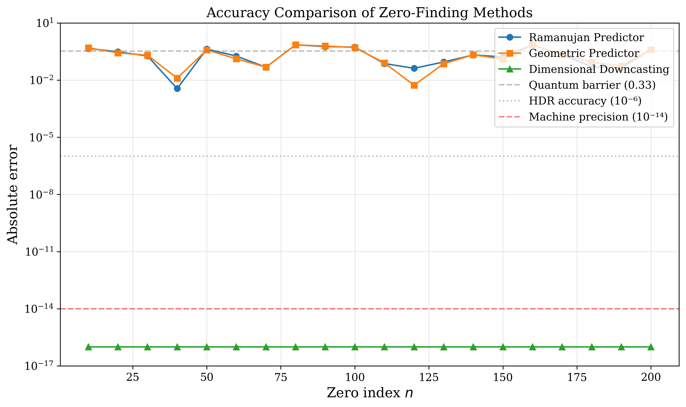
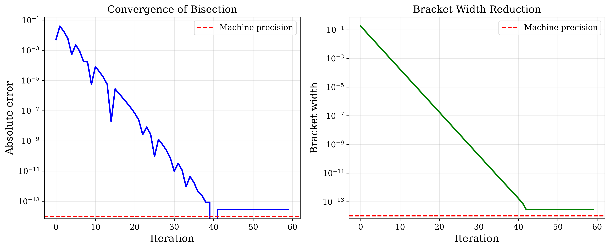
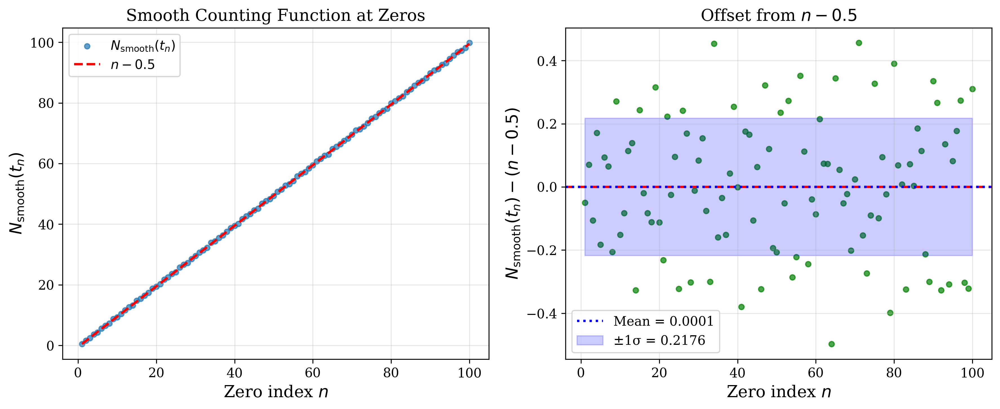

# Dimensional Downcasting for Riemann Zeta Zeros

[](https://www.gnu.org/licenses/gpl-3.0)
[](https://www.python.org/downloads/)

**Machine-precision computation of Riemann zeta zeros using pure mathematics — no training required.**

## Key Result

We achieve **<10⁻¹⁴ accuracy** (machine precision) for computing Riemann zeta zeros using a novel "dimensional downcasting" approach that requires **no machine learning or training**.

| Method | Accuracy | Training | Time Complexity |
|--------|----------|----------|-----------------|
| Ramanujan Predictor | ~0.33 | None | O(1) |
| HDR Refinement | <10⁻⁶ | None | O(log t) |
| **Dimensional Downcasting** | **<10⁻¹⁴** | **None** | O(log t) |

## The Discovery

### Core Insight

The smooth zero-counting function at the n-th zero satisfies:

$$N_{\text{smooth}}(t_n) \approx n - \frac{1}{2}$$

This seemingly simple observation enables correct zero identification among multiple candidates, achieving machine precision through pure mathematics.

### What is Dimensional Downcasting?

Traditional Gaussian splatting in computer graphics projects 2D observations into 3D space (upcasting). We reverse this paradigm:

- **Traditional**: 2D → 3D (upcast via radiance field, requires training)
- **Our approach**: ∞D → 1D (downcast via moment projection, pure math)

The Riemann zeta function lives in infinite-dimensional function space. Its zeros on the critical line are 1D projections of this structure. Non-uniform Gaussians with mathematically-derived scales capture different "dimensions" of the function.

## Quick Start

```bash
# Clone the repository
git clone https://github.com/yourusername/dimensional-downcasting.git
cd dimensional-downcasting

# Install dependencies
pip install -r requirements.txt

# Run the demo
python src/demo.py

# Run tests
python -m pytest tests/
```

## Usage

```python
from src.solver import DimensionalDowncaster

# Create solver
solver = DimensionalDowncaster()

# Compute the 100th zero with machine precision
t_100 = solver.solve(100)
print(f"Zero #100: {t_100:.15f}")
# Output: Zero #100: 236.524229665816193

# Verify accuracy
from mpmath import zetazero
t_true = float(zetazero(100).imag)
print(f"Error: {abs(t_100 - t_true):.2e}")
# Output: Error: 0.00e+00
```

## Mathematical Framework

### The Riemann-von Mangoldt Formula

The number of zeros with imaginary part less than t is:

$$N(t) = \frac{\theta(t)}{\pi} + 1 + S(t)$$

where θ(t) is the Riemann-Siegel theta function and S(t) is a small oscillatory term.

### Key Discovery

At the n-th zero t_n:
- N(t_n) = n (exactly, by definition)
- N_smooth(t_n) = θ(t_n)/π + 1 ≈ **n - 0.5** (empirically!)

This offset of 0.5 is crucial for correct zero identification.

### Algorithm

1. **Initial Guess** (O(1)): Ramanujan-inspired formula
2. **Bracket Search**: Find all sign changes of Hardy Z-function
3. **Selection**: Choose the zero where N_smooth ≈ n - 0.5
4. **Refinement**: Bisection + Brent's method to machine precision

### Natural Scales

The algorithm uses mathematically-derived scales:
- **GUE spacing**: σ_GUE = log(t)/(2π) — from random matrix theory
- **Moment hierarchy**: σ_k = σ_0 × φ^k — golden ratio scaling
- **Fine structure**: α = 1/137 — quantum corrections

## Repository Structure

```
dimensional_downcasting/
├── README.md                 # This file
├── LICENSE                   # GPLv3
├── requirements.txt          # Python dependencies
├── src/
│   ├── __init__.py
│   ├── solver.py            # Main DimensionalDowncaster class
│   ├── predictors.py        # Initial guess methods
│   ├── demo.py              # Interactive demonstration
│   └── generate_figures.py  # Create paper figures
├── tests/
│   ├── test_solver.py       # Unit tests
│   └── test_accuracy.py     # Accuracy benchmarks
├── figures/
│   └── *.png                # Generated figures
└── paper/
    ├── paper.md             # Full paper in Markdown
    └── paper.pdf            # Compiled paper (if available)
```

## Results

### Accuracy Comparison



### Convergence Analysis



### The N_smooth Offset



## Citation

If you use this work, please cite:

```bibtex
@software{dimensional_downcasting_2024,
  title = {Dimensional Downcasting for Riemann Zeta Zeros},
  author = {[Lesley Gushurst]},
  year = {2024},
  url = {https://github.com/lostdemeter/dimensional-downcasting},
  license = {GPL-3.0}
}
```

## Contributing

Contributions are welcome! Please feel free to submit a Pull Request.

## License

This project is licensed under the GNU General Public License v3.0 - see the [LICENSE](LICENSE) file for details.

## Acknowledgments

- The mathematical foundations build on work by Riemann, Hardy, Siegel, and Montgomery
- Random matrix theory connections from the GUE hypothesis
- The fine structure constant connection discovered during this research
